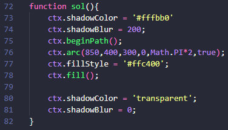

# Explicação do cenário feito pelo canvas
Feito por: Cauã Silva e Carlos Alarcon

## HTML

 

Foi feita a estrutura básica do HTML e adicionado um canvas com um id, largura e altura.

## CSS

 

Colocamos uma cor de fundo no body com um tom azulado e mexemos na id do canvas para deixar organizado e colocar uma cor gradiante de fundo com os tons vermelho, amarelo e laranja para dar um efeito de pôr do sol.

## JS
### Primeiros passos:

 

O código acima foi feito para pegar a id "myCanvas" com uma const chamada canvas e mostrar o que vai ser renderizado com uma const chamada ctx.

 

### Como foi feito o chão:

 

O código acima foi utilizado apenas para fazer a parte verde do gramado. Ele foi feito com linhas e curvas começando com um moveTo e finalizando com um lineTo na mesma posição do moveTo. O chao foi colorido com uma cor verde para dar uma aparência de grama (com o código fillStyle), junto com uma borda com um verde mais escuro para dar um efeito (com o código strokeStyle).

 

### Como foi feito as montanhas:

 

As montanhas foram feitas inteiramente com linhas, a única diferença é em suas cores, que foram variando do laranja claro para o mais escuro para dar o efeito do pôr do sol.

 

### Como foi feito o sol:

 

O sol foi feito com um circulo feito pelo código "ctx.arc" e colorido de amarelo. Para fazer o efeito de brilho no sol, foi usado os código "ctx.shadowColor" para definir a cor da sombra (que será usada como brilho) e o "ctx.shadowBlur" que é o desfoque da sombra. No final colocamos o shadowColor como transparente e o shadowBlur como 0 para não interferir em outros objetos.

 

### Como foi feito as nuvens:

 

A nuvem foi feita com 3 circulos brancos, onde o que ta no meio tem o raio maior, e os dois das pontas tem o raio menor e igual.

 

### Como foi feito os pássaros:

 

Os pássaros foram feitos com curvas "quadraticCurveTo", onde o moveTo é o seu ponto inicial e as curvas são as asas. Colocamos um "strokeStyle" na cor preta e aumentamos a largura da linha.

 

### Como foi feito as árvores:

 

Foram feitos três círculos um maior que o outro que representam as folhas das árvores, sendo o com raio maior o com tom de verde mais escuro e o que fica na parte de baixo, o médio fica no meio e com um tom mais claro e o menor fica em cima com um tom mais claro de verde que os outros. Os galhos foram feitos com linhas retas e curvas "quadraticCurveTo" para serem os galhos curvados no circulo grande e médio, eles foram coloridos com um tom de marrom escuro e foi utlizado o "lineWidth" para dar uma engrossada.
