# Explicação do cenário feito pelo canvas
Feito por: Cauã Silva e Carlos Alarcon 2ºJogos Digitais 🎮

## HTML
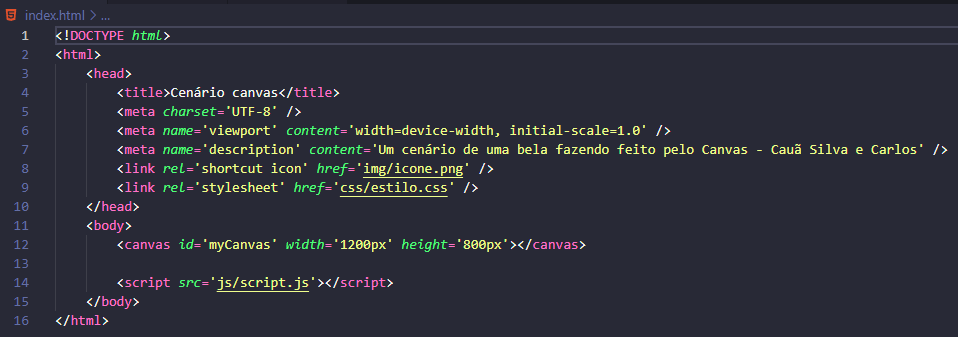

Foi feita a estrutura básica do HTML e adicionado um canvas com um id, largura e altura.

## CSS
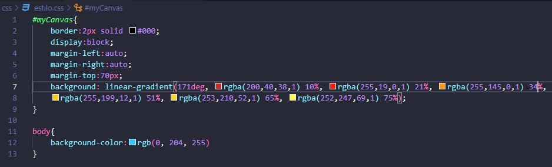

Colocamos uma cor de fundo no body com um tom azulado e mexemos na id do canvas para deixar organizado e colocar uma cor gradiante de fundo com os tons vermelho, amarelo e laranja para dar um efeito de pôr do sol.

## JS
### Primeiros passos:
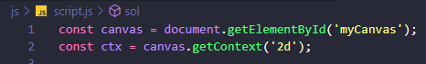

O código acima foi feito para pegar a id "myCanvas" com uma const chamada canvas e mostrar o que vai ser renderizado com uma const chamada ctx.

### Como foi feito o chão:
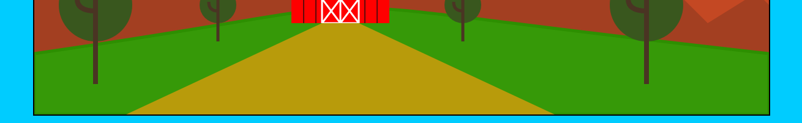
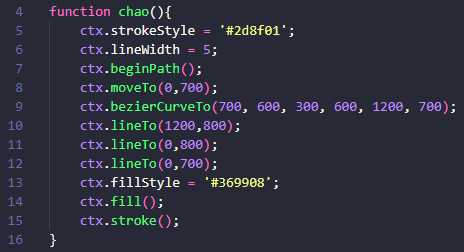

O código acima foi utilizado apenas para fazer a parte verde do gramado. Ele foi feito com linhas e curvas começando com um moveTo e finalizando com um lineTo na mesma posição do moveTo. O chao foi colorido com uma cor verde para dar uma aparência de grama (com o código fillStyle), junto com uma borda com um verde mais escuro para dar um efeito (com o código strokeStyle).

### Como foi feito as montanhas:
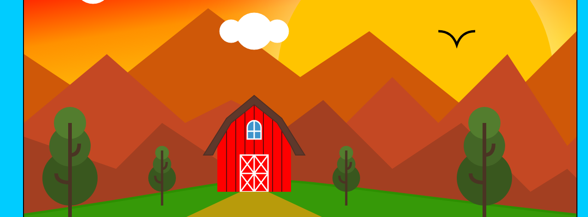
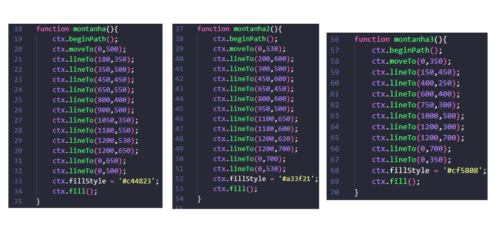

As montanhas foram feitas inteiramente com linhas, a única diferença é em suas cores, que foram variando do laranja claro para o mais escuro para dar o efeito do pôr do sol.

### Como foi feito o sol:
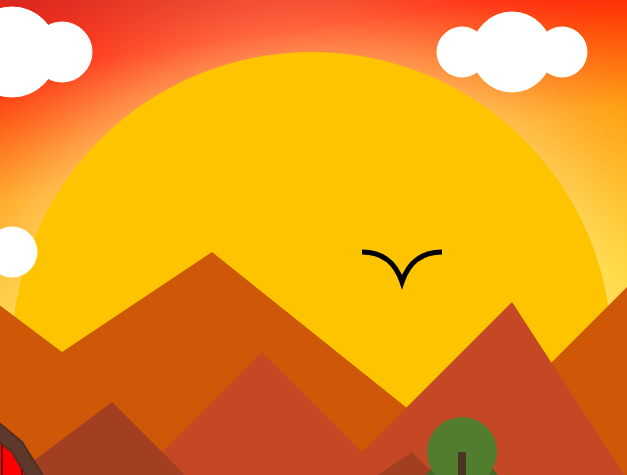
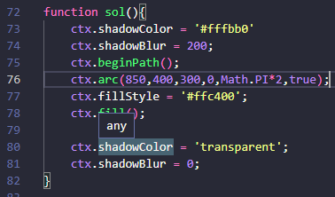

O sol foi feito com um circulo feito pelo código "ctx.arc" e colorido de amarelo. Para fazer o efeito de brilho no sol, foi usado os código "ctx.shadowColor" para definir a cor da sombra (que será usada como brilho) e o "ctx.shadowBlur" que é o desfoque da sombra. No final colocamos o shadowColor como transparente e o shadowBlur como 0 para não interferir em outros objetos.

### Como foi feito as nuvens:
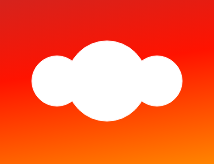
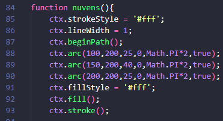

A nuvem foi feita com 3 circulos brancos, onde o que ta no meio tem o raio maior, e os dois das pontas tem o raio menor e igual.

### Como foi feito os pássaros:
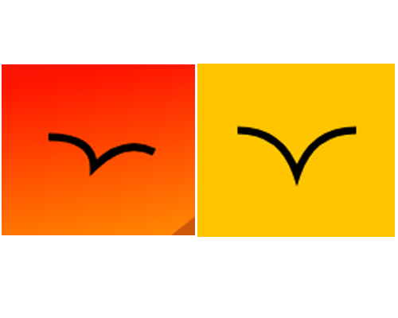
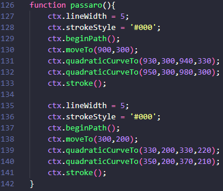

Os pássaros foram feitos com curvas "quadraticCurveTo", onde o moveTo é o seu ponto inicial e as curvas são as asas. Colocamos um "strokeStyle" na cor preta e aumentamos a largura da linha.

### Como foi feito as árvores:
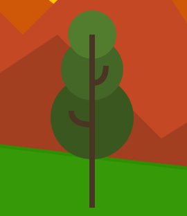
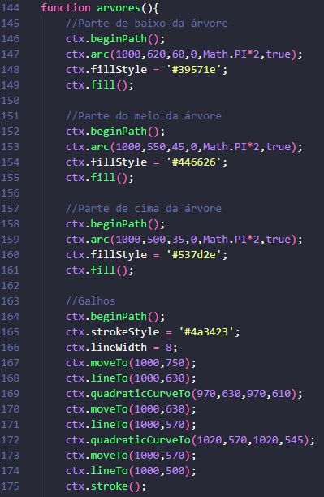

Foram feitos três círculos um maior que o outro que representam as folhas das árvores, sendo o com raio maior o com tom de verde mais escuro e o que fica na parte de baixo, o médio fica no meio e com um tom mais claro e o menor fica em cima com um tom mais claro de verde que os outros. Os galhos foram feitos com linhas retas e curvas "quadraticCurveTo" para serem os galhos curvados no circulo grande e médio, eles foram coloridos com um tom de marrom escuro e foi utlizado o "lineWidth" para dar uma engrossada.

### Como foi feito o celeiro:
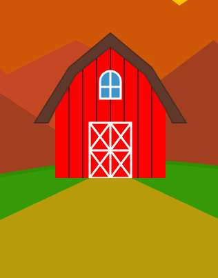
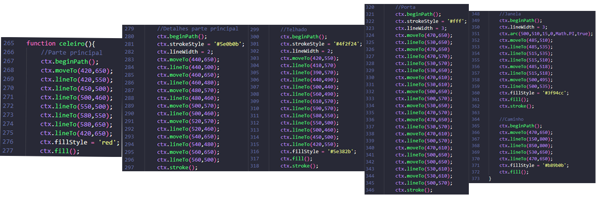

O celeiro foi feito usando apenas os comando de "moveTo" que é de onde começa a linha e "lineTo" que é de onde termina a linha e apenas uma vez o "arc" para fazer a janela, além dos de cores "fillStyle" e "strokeStyle" e os de aumentar a largura da linha "lineWidth". 

A primeira seção "//Parte principal" define a forma geral da casa, desenhando um polígono com linhas e preenchendo-o com a cor vermelha.
 

A segunda seção "//Detalhes parte principal" adiciona detalhes à parte principal da casa, desenhando linhas com cores vermelhas mais escuras. 
 

A terceira seção "//Telhado" desenha o telhado da casa, criando um polígono com uma cor marrom.
 

A quarta seção "//Porta" desenha a porta da casa, utilizando linhas e a cor branca.
 

A quinta seção "//Janela" desenha uma janela na casa, utilizando uma combinação de linhas e um arco circular pela metade.
 

A sexta seção "//Caminho" desenha um caminho em frente à casa, criando uma forma que da um efeito de perspectiva com uma cor dourada.

### Finalizando:

Para finalizar, chamamos as funções na seguinte ordem:

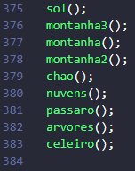

### Resultado:
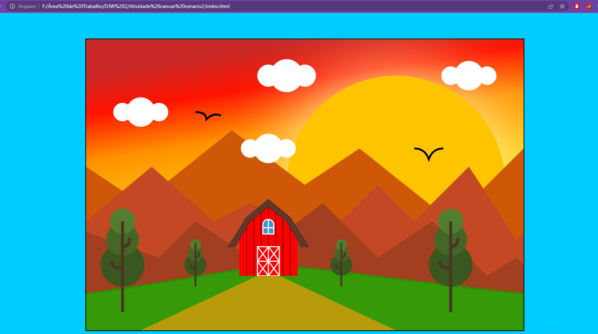
